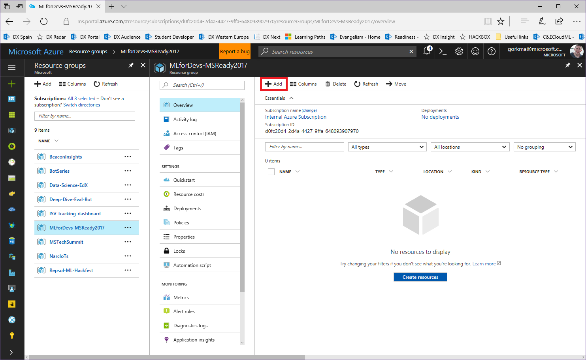
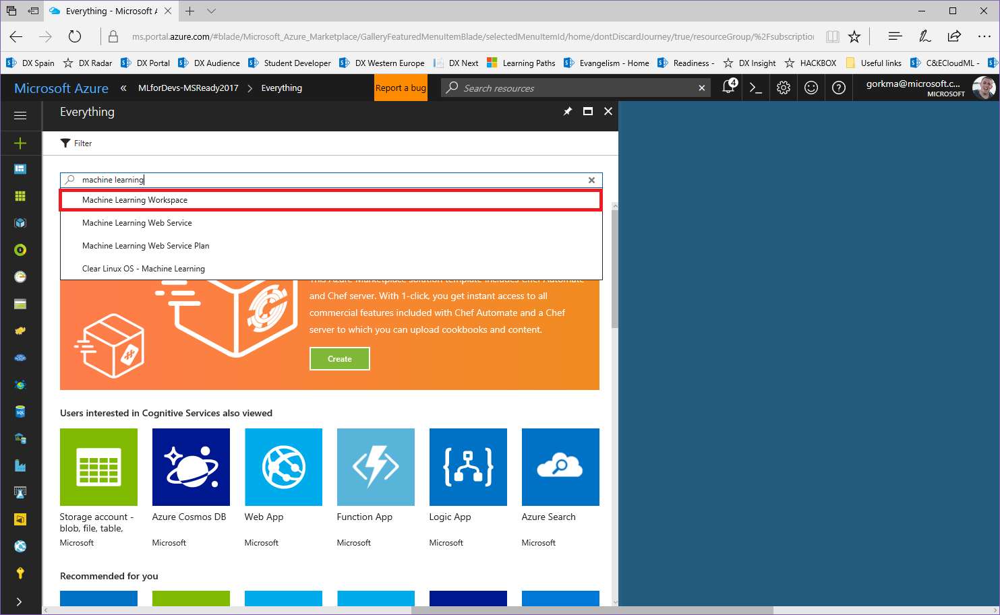
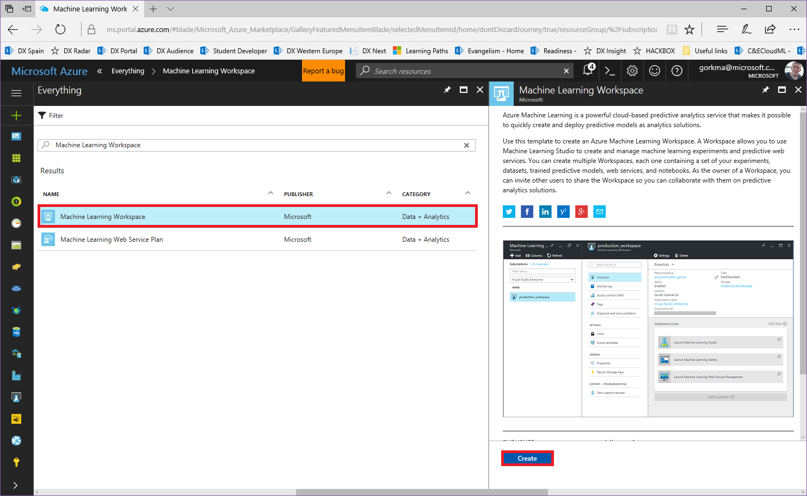
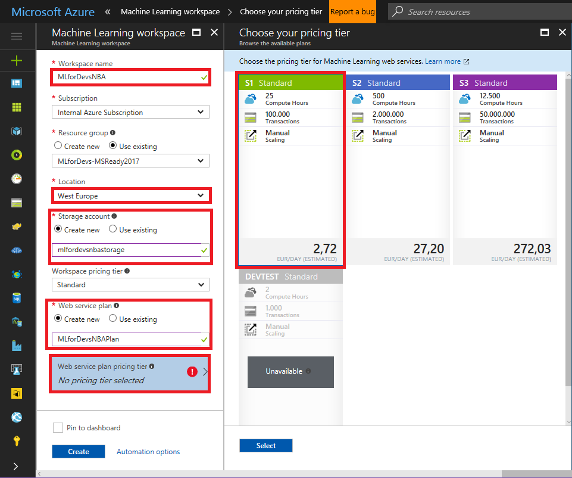
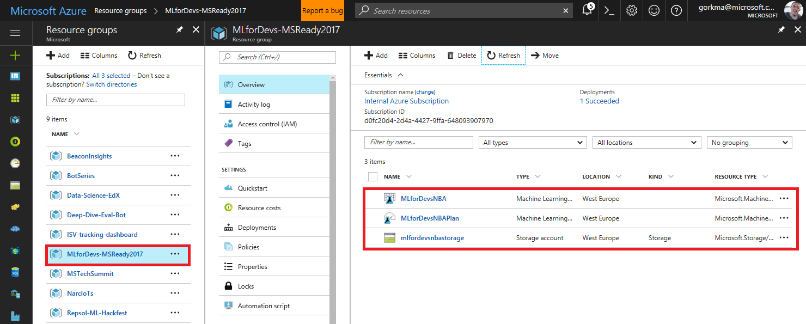
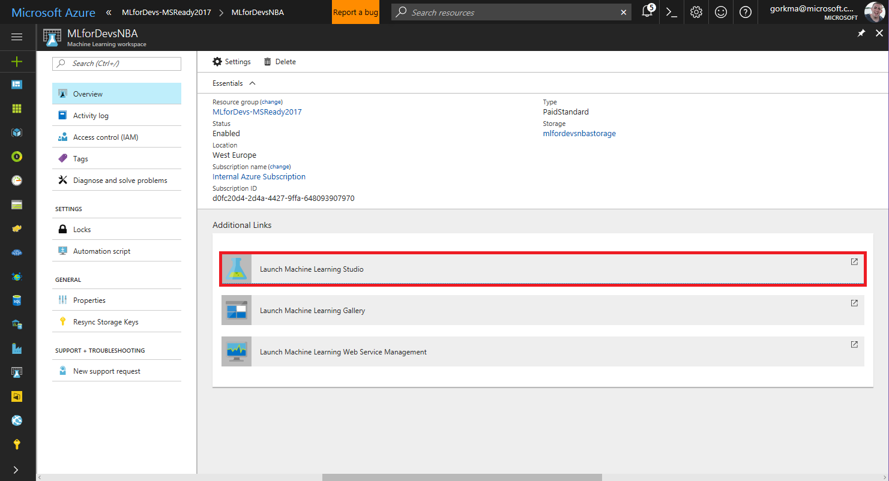
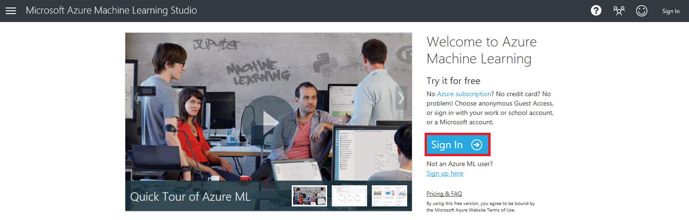
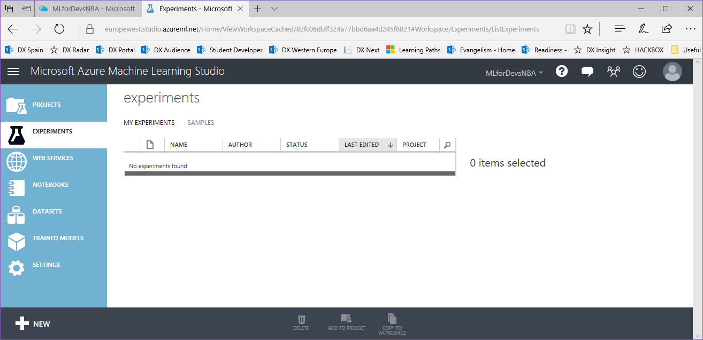

[<- Lab overview](./README.md)

# Chapter 1 – Getting things ready: Sign-up/sign-in to Azure and AzureML Studio

First of all, an Azure subscription is a pre-requisite for this Instructor Led Lab. You can use your internal account, MSDN subscription or a free trial ( [https://azure.microsoft.com/en-us/free/](https://azure.microsoft.com/en-us/free/)) to complete this lab.

Once we have our Azure subscription set up, we also need to create our Azure ML workspace and sign in to the tool:

1. Create an Azure Machine Learning workspace on the Azure subscription:

2. Select the workspace name, location, the storage account to be used, and the service plan tier to deploy the experiment web service after its creation:

3. Now, you can find the 3 resources on the resource group in which they have been created:

4. Browsing the first one, which is the Machine Learning Workspace, Launch Machine Learning Studio and Sign In:

5. This is the first view of the Azure ML online tool, an empty list of experiments. Note that the region that you selected as a location for the workspace is the start of the url, and you can also browse for different regions or workspaces on the top bar:

[-> Chapter 2 - Create project and import data](./02-Create%20project%20and%20import%20data.md)