# Chapter 3 - Data prep &amp; cleanse

As we can see by exploring our data, there are several things that are distorting our dataset (special characters on the names, header rows all over the file…), missing values, fields treated as text when they are numbers…

In order to get the best results out of our experiment, we should prepare and clean our data properly, and in this section we&#39;ll take advantage of some of the built-in modules of Azure ML to accomplish our goal.

First of all, as some players had some special conditions on specific seasons, they are marked with an asterisk on their names. This special character, which is not part of the real name of the player, could distort our dataset affecting at the quality of our results, as the same player could be treated as a different one depending on this.

On the left menu, under the &quot;Text Analytics&quot; category, we can find the &quot;Preprocess Text&quot; module, which will take care of this for us by just unchecking all the checkboxes except the &quot;Remove special characters&quot; one. Note also that we should set the language to English on the first dropdown, and select the desired column (Player, in this case) to apply the transformation.

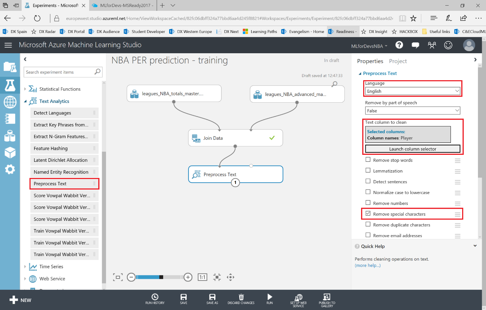

If we run the experiment again, we&#39;ll have a dataset as a result, containing both the original Player column and the new column (Preprocessed Player) removing special characters:

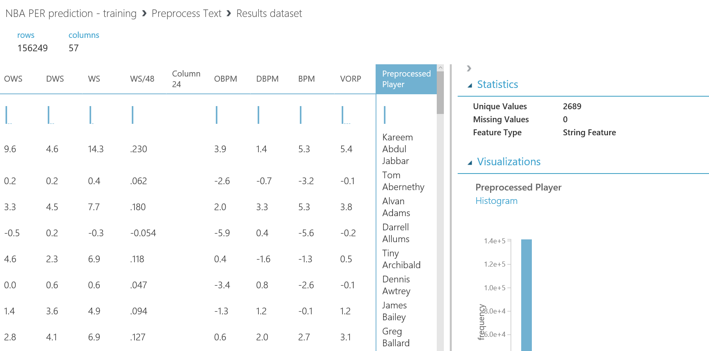

Also, to keep things simple, we can change the names of our columns using the &quot;Edit Metadata&quot; module, so we can create simpler queries further on or find the features on our dataset by a more descriptive name than the acronym. In this case, we&#39;ll change the name of `Rk, Pos, Tm, G, GS, MP, FG, 3P, 2P, FT, Preprocessed Player` to by selecting the columns on the column selector and typing the following on the &quot;New column names&quot; texbox:

Note that the order matters, as what this module does is change the name of each column selected with the text on the same position on the comma-separated list of new names, so both lists must be on the same order and have the same length.

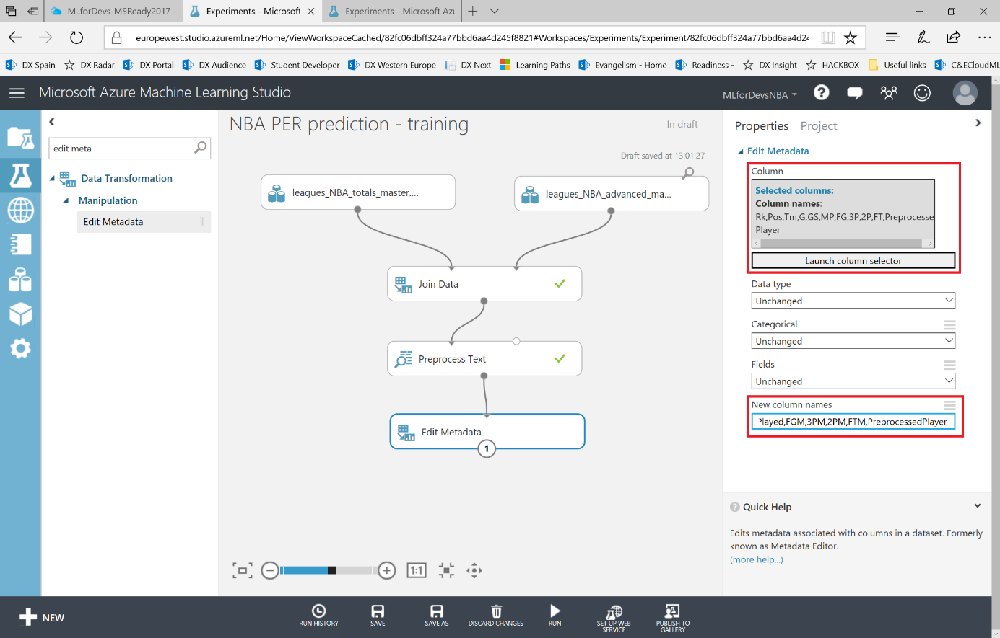

To avoid duplicates and keep things simple, we will assign the clean value of the player name to the Player column, and also delete all the header rows that we can find between data rows. To accomplish that, Azure ML has a SQL query module which will allow us to treat our dataset (or datasets, up to three of them for each module) as a database table, so we can perform transformations via t-SQL queries. Look for the &quot;Apply SQL Transformation&quot; module under &quot;Data Transformation &gt; Manipulation&quot; Category, and connect the resulting dataset with one of the entry points of the SQL query module. As it has 3 different entry points, one for each possible dataset, it will address them by t1/t2/t3 on the query. In this case, we&#39;ll input a simple query filtering those header values and replacing the Player value for each record on our dataset with the following query:

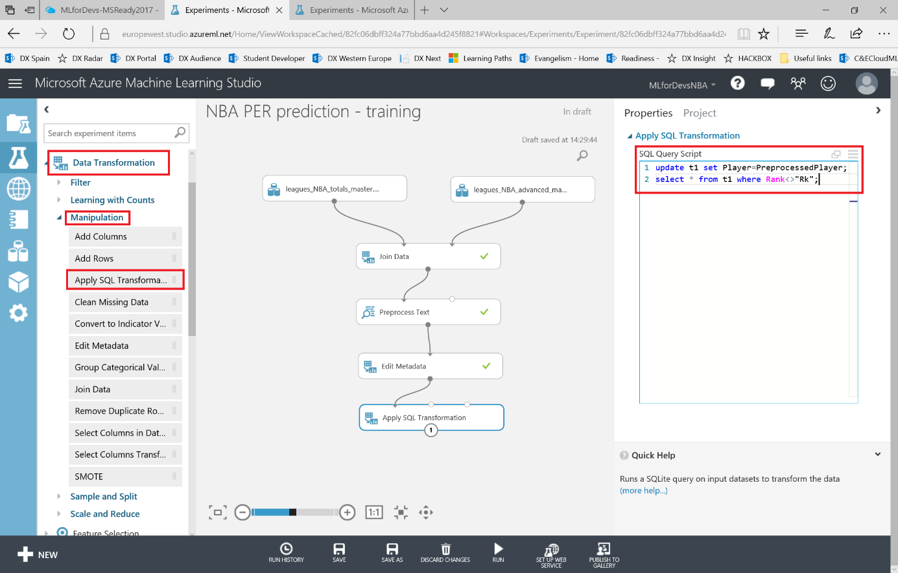

If you run the experiment again, you&#39;ll notice that now we have over 14k rows instead of the initial 16k, and no header rows are now included on our data.

In order to perform several numeric operations (such as clipping values, replacing missing values, etc.), we need to make sure that the tool is handling every numeric column as either Integer or Floating point types. The &quot;Edit Metadata&quot; module will help us again to accomplish that, so we&#39;ll need to add another two modules, one for the Integer columns `Rank,Age,GamesPlayed,GamesStarted,MinutesPlayed,FGM,FGA,3PM,3PA,2PM,2PA,FTM,FTA,ORB,DRB,TRB,AST,STL,BLK,TOV,PF,PTS,Season` and another one for the Floating point columns `FG%,3P%,2P%,eFG%,FT%,PER,TS%,3PAr,FTr,ORB%,DRB%,TRB%,AST%,STL%,BLK%,TOV%,USG%,OWS,DWS,WS,WS/48,OBPM,DBPM,BPM,VORP`, selecting those columns using the column selector.

We need to run the experiment before adding the second one, as it will need the previous resulting dataset as input for the second one, so the tool knows the name of every column. Once those modules are included, the experiment should look like this:

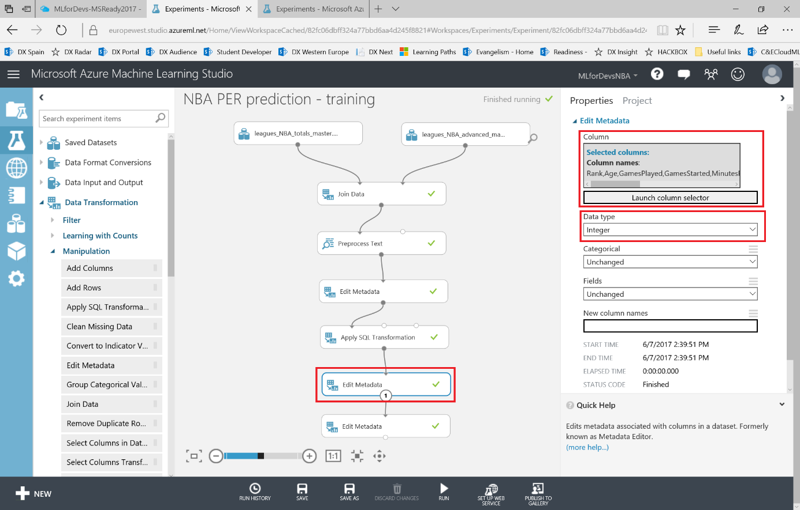

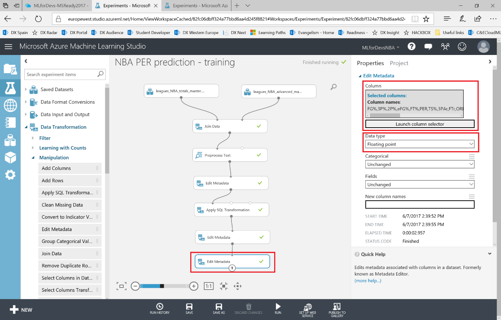

Now that we are sure that every column is handled properly, let&#39;s clean our data by analyzing the time a value is missing. Look for the &quot;Clean Missing Data&quot; module on the left menu, under &quot;Data Transformation &gt; Manipulation&quot; category. In this case, we&#39;ll focus on the numeric values of our dataset, and with this module we can choose what to do when a missing value is found (custom substitution value to replace the missing value with one of your choice, replace with mean, replace with median, replace with mode, remove the row, remove the column or replace using Probabilistic PCA).

Normally, what we should do is remove the entire row; but in this case let&#39;s just replace the missing numeric values with the mean value by selecting this option on the dropdown, so we can analyze how many times it happened to decide if the feature affected is relevant (few replacements, so the data is valid) or not.

In this case, as we already made sure that the numeric values are treated as those, we can select the columns by type instead of name on the column selector. Launch it, mark the &quot;WITH RULES&quot; tab, click on &quot;NO COLUMNS&quot; button and then add one rule for each numeric type (Numeric, Integer, Double) available on the dropdown:

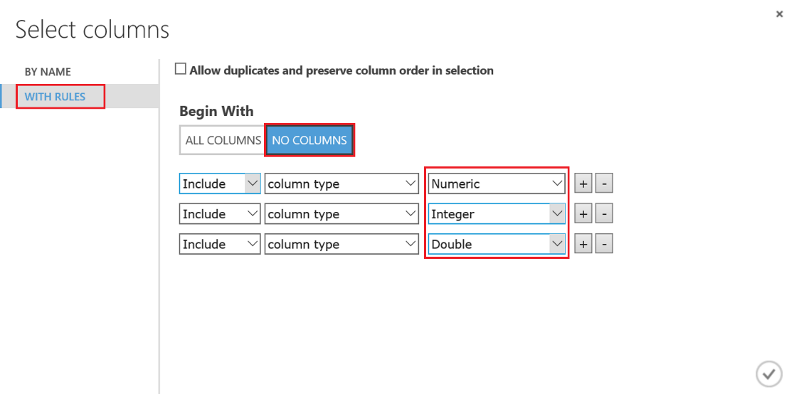

Note the last checkbox on this module, named &quot;Generate missing value indicator column&quot;, as it will help us to visualize whether a column is relevant or not using a boolean column to help us visualize and understand it. Mark the checkbox and then run the experiment.

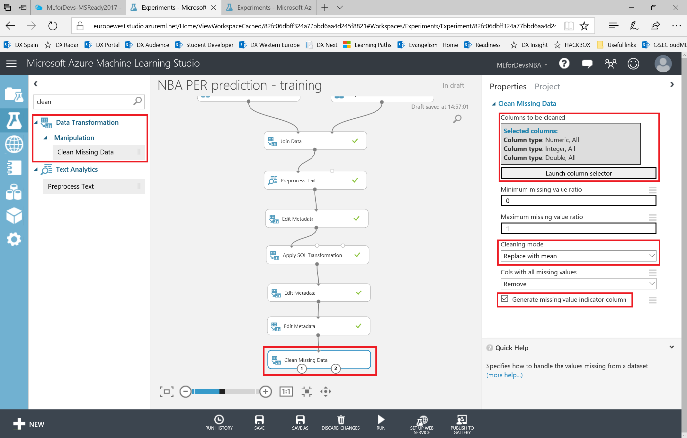

After running the experiment, if you visualize the resulting dataset and scroll right to the last columns, you can notice that several columns &quot;&lt;&lt;feature\_name&gt;&gt;\_isMissing columns have been added to your dataset, and taking the &quot;GamesStarted\_isMissing&quot; column as an example it&#39;s easy to understand that, as the values on this column have been missing most of the times, is not relevant for you as you&#39;d be using more fictional values (out of the replacement) than real values. For the rest of the columns, as the replaced values are really low, you can keep considering them relevant for the experiment.

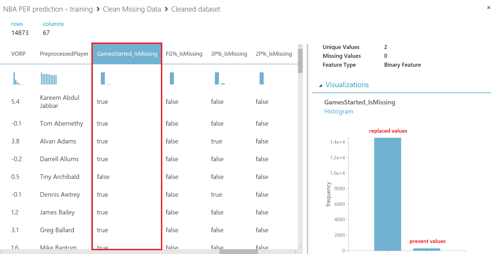

Anyway, in this experiment we won&#39;t use all these numeric values, as we won&#39;t know them prior to the season and we are looking for a prediction of the player&#39;s PER, the numeric value that summarizes his contribution and will help us select the best players for our fantasy team. Let&#39;s select then just the columns that we will use:

- The known inputs for our experiment (Player, Position, Age, Team and Season)
- The feature to be predicted (PER)

On the left menu, look for the &quot;Select Columns in Dataset&quot; module, under &quot;Data Transformation &gt; Manipulation&quot; category, drag it to your canvas and connect its input point with the left output point of the previous module, the one containing the resulting dataset. To select the columns that you need, just launch the column selector and pick them by name:

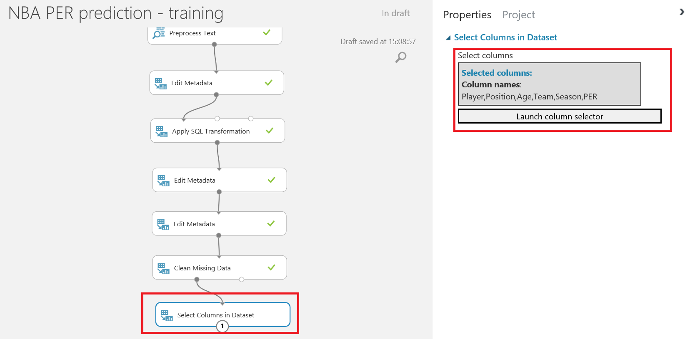

After running the experiment again, you&#39;ll have a +14k rows - 6 columns dataset, which you will use to train and evaluate your model following next.

The last transformation to perform on our dataset is clipping the values for the feature we want to predict, the PER (Player Efficiency Rating), as it is a well-known stat that never has been higher than 35. In this case, we&#39;ll also assume that any player will get a negative PER value for a season, so will also clip the smallest values.

What we are trying to accomplish with this clipping, both of peaks (high values above the normal threshold of a feature) and sub-peaks (low values below the normal threshold of the feature), is to create a normalized dataset, in which most of the values will be around the average, creating a Gauss curve when graphically represented. It is the best type of dataset to train a model, as it will have fewer low and high values, and the greatest amount of values will be &quot;normal&quot;, i.e., around the average value. Click on the link if you want to learn more about [Gaussian or normal distribution](https://en.wikipedia.org/wiki/Normal_distribution), as it is a very common continuous probability distribution, important in statistics and often used to represent real-valued random variables whose distributions are not known.

To normalize the values of our PER feature for training purposes, look for the &quot;Clip Values&quot; module under &quot;Data Transformation &gt; Scale and Reduce&quot; category on the left menu and drag it to your canvas. When connected to the previous module, select the &quot;ClipPeaksAndSubpeaks&quot; option on the &quot;Set of thresholds&quot; dropdown, set the values for upper threshold (35) and lower threshold (0) as they will be the maximum and minimum values accepted, and select just the PER column using the column selector.

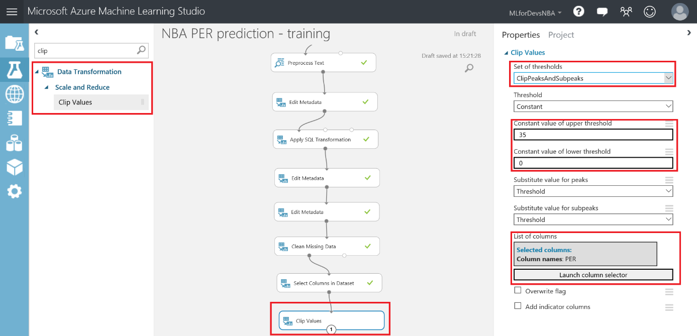

After running the experiment again, you can visualize that our PER feature is a normal distribution by definition. Right-click on the output point of the &quot;Clip Values&quot; module, then &quot;Visualize&quot; and select the PER column. On the right pane of the visualization pop-up you will see a graphic representation of the selected column as a vertical bar chart, displaying a normal distribution (slightly skewed to the left, as there are more players below the league average than above it…a.k.a. the Superstar Zone):

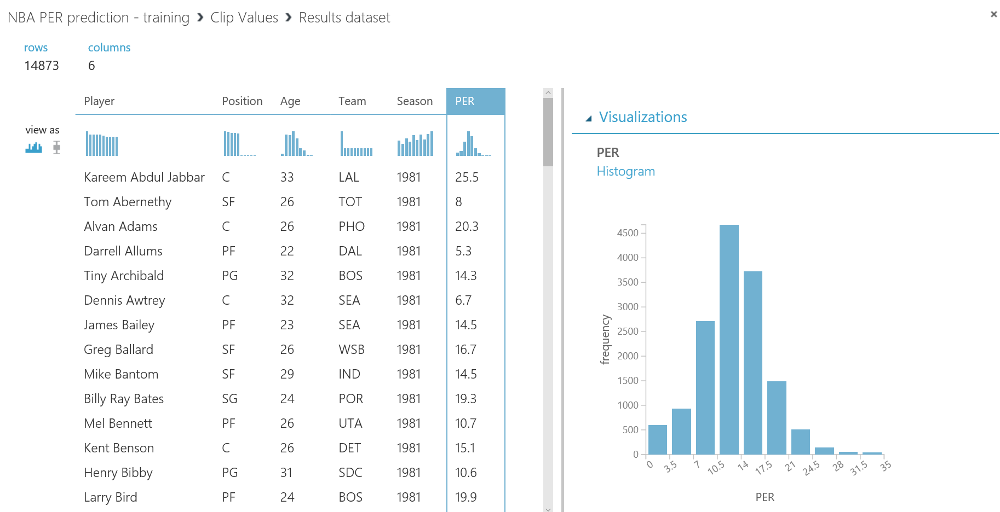