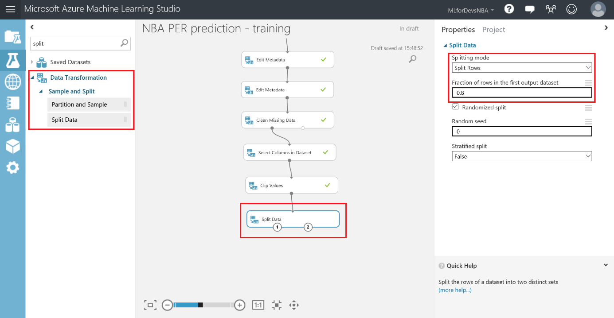
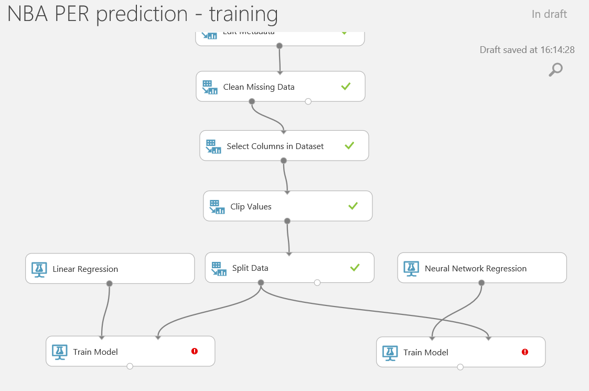
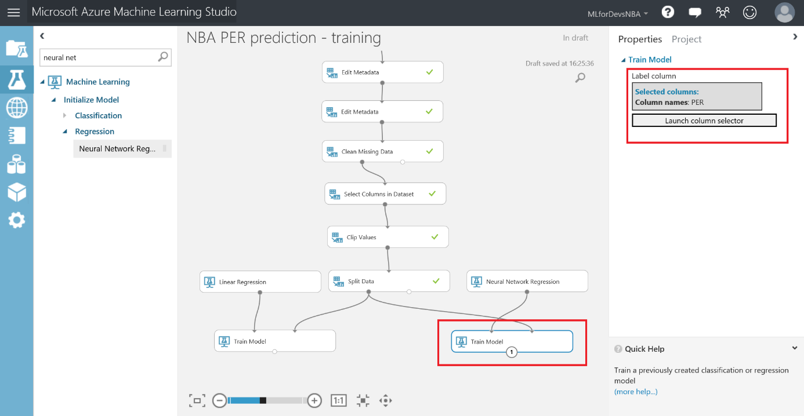
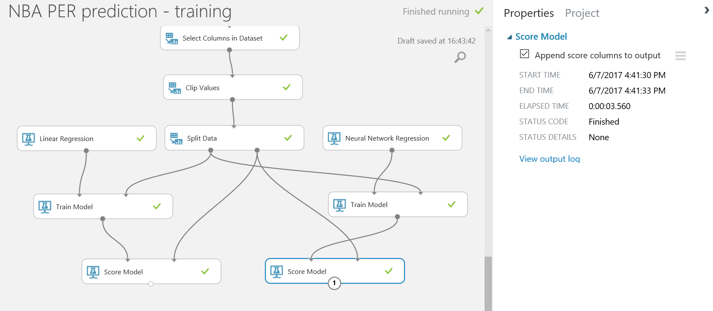
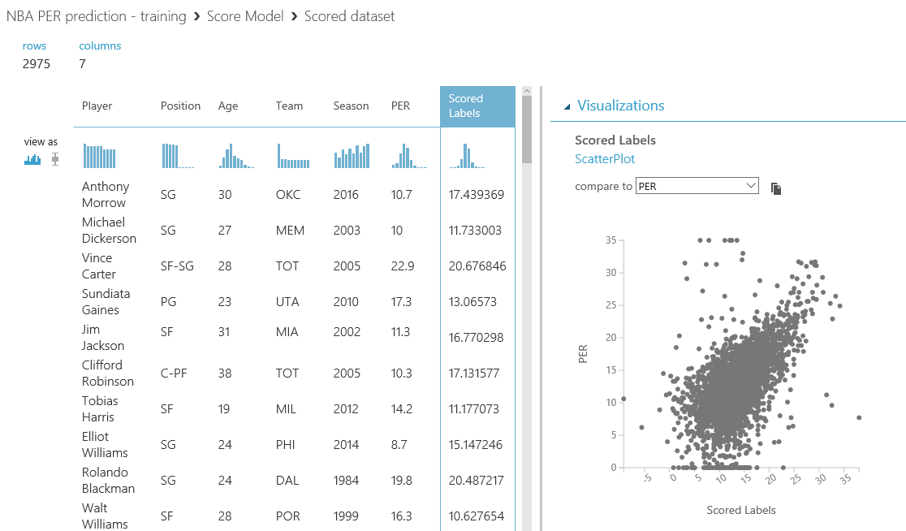
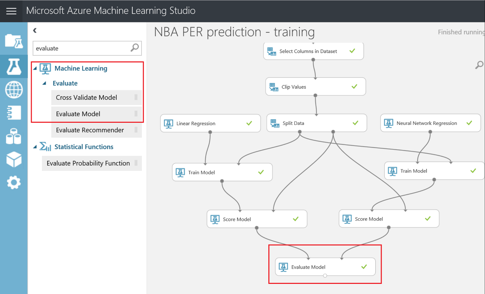
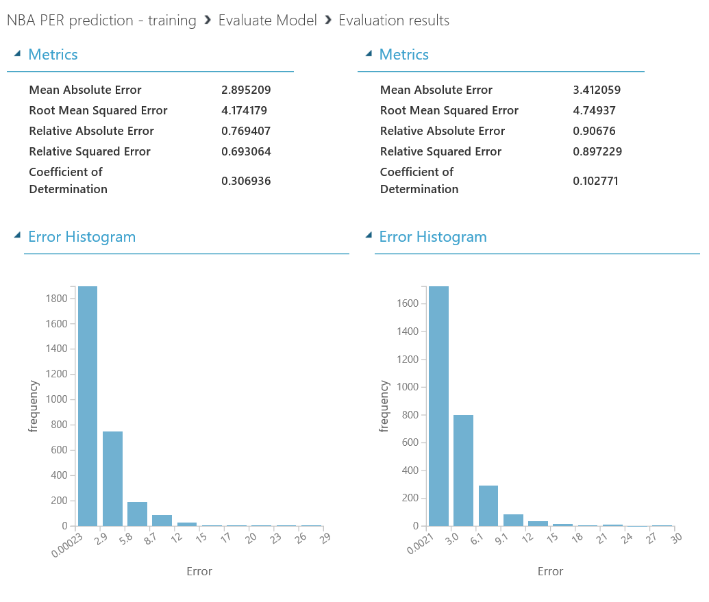

# Chapter 4 - Train and evaluate your model

Now that your data is cleaned an prepared for training, is time to train a model that could help us to predict future values for the Player Efficiency Rating for every NBA player. The first point to understand regarding the training is how it works, which is basically by comparing predicted values with known values, so you can evaluate the accuracy of the model and keep polishing it until you get the best results possible.

For you to be able to compare these predicted values with the known ones, you&#39;ll need to split our dataset in two:

- Training set, which will be the values used to train the model which will generate the prediction
- Testing set, which will be the one to be used against this trained model, and will have the known value (the actual value on the dataset) and the value predicted by the model, so you can compare both of them

In this case, as you are predicting a numeric value, you are facing a regression problem. In these problems, the desired outcome is a diagonal-ish graphical representation of the resulting prediction when plotted with the known values, as it will indicate that predicted values are accurate or close to the actual ones. This graphical representation will put the known value on one axis (vertical, let&#39;s say) and the predicted value on the other axis, and plot the point based on those values. That&#39;s why the closest to a diagonal, the better your model is performing. But no worries, we&#39;ll get to it in a little while.

The other type of problems to be addressed with Machine Learning techniques could be classification (apply 2 or more labels or categories to a given input data), clustering and anomaly detection. Fortunately for us, not expert data scientists, there is a cheat sheet available to help us decide which is the best algorithm to use on our experiments: [http://aka.ms/MLCheatSheet](http://aka.ms/MLCheatSheet), and it will also help you to get a deeper understanding of the concepts below these type of problems and algorithms, and how to choose better when facing them.

Here, as you are facing a classical regression problem, you will use two of the most common regression algorithms: Linear Regression and Neural Network regression, and you&#39;ll evaluate both of them to decide which one is performing better and use this model for your future predictions.

First things first: let&#39;s split our dataset to get both the training and the testing dataset. Look for the &quot;Split Data&quot; module under &quot;Data Transformation &gt; Sample and Split&quot;, and drag it to your canvas, connecting its input with the &quot;Clip Values&quot; output. Let&#39;s keep &quot;Split Rows&quot; as the Splitting mode, and just select the percentage of rows for the first dataset, on a value between 0 and 1. Most of the times, 80% of the rows on the dataset are destined to training and the other 20% is for testing/evaluation, so let&#39;s use these values for now. As a result, we&#39;ll have two datasets: one with around 12k rows for training (left output point) and another one with almost 3k rows for evaluation (right output point), and you can visualize both of them.

Once you have both datasets ready, it&#39;s time to train your model…or models in this case, as you&#39;ll be using two different algorithms at the same time to compare them. To accomplish that, you&#39;ll need two &quot;Train Model&quot; modules (under &quot;Machine Learning &gt; Train&quot; category), the &quot;Linear Regression&quot; algorithm module and the &quot;Neural Network Regression&quot; algorithm module (both under &quot;Machine Learning &gt; Initialize Model &gt; Regression&quot; category).

Once added to your canvas, you&#39;ll need to connect each algorithm with the left input point of one &quot;Train Model&quot; module, and the training dataset (the left output point of the &quot;Split Data&quot; module) with the right input point of both &quot;Train Model&quot; modules. The setup would look like this:

To configure both &quot;Train Model&quot; modules, you just need to select them and choose the feature to predict (PER, in this case) by using the column selector:

Now that you trained both models, let&#39;s evaluate them by scoring them with the testing dataset, the other 20% of our cleaned data. Look for the &quot;Score Model&quot; module on the left menu (under &quot;Machine Learning &gt; Score Model&quot;) and drag two of them to your canvas. In this case, you need to connect the output from each &quot;Train Model&quot; module to the left input from each &quot;Score Model&quot; module, and the second output from the &quot;Split Data&quot; module to the right input point from both &quot;Score Model&quot; modules, just like this:

Run the experiment, and when completed, you&#39;ll be able to visualize the results of the predictions using both algorithms. The first thing you can do to evaluate the results of your model is visualize the resulting scored dataset and compare the known value (PER) with the predicted value (Scored Labels). Right click on the output point of any &quot;Score Model&quot; module, and with the visualization pop-up opened, select the &quot;Scored Labels&quot; column. On the right pane, select the &quot;PER&quot; column on the &quot;compare to&quot; dropdown, and you&#39;ll get the plotting with both the known value and the prediction.

As you can see, this is not much of a diagonal on the chart shown, so our model is not performing very well. For example, there are plenty of outliers, the area covered is too big (showing that the results are very disperse and apart from reality)…so, you still have work to do improving your model.

But, so you don&#39;t just evaluate the model by the image of a chart, there is an &quot;Evaluate Model&quot; module on the left menu, under the &quot;Machine Learning &gt; Evaluate&quot; category, which will give you more empirical insights about the performance of your model, such as mean absolute error and coefficient of determination, among others. Just connect both &quot;Score Model&quot; modules with the inputs of the &quot;Evaluate Model&quot; module, so your experiment looks like this:

Let&#39;s check these values by right clicking the output point of the &quot;Evaluate Model&quot; module and then &quot;Visualize&quot;. This last one, the Coefficient of Determination, will measure the percentage of accuracy that your model has; so the higher, the better!

As you can see, both algorithms are performing really bad, with 30% and 10% accuracy, so let&#39;s see how to improve our model with some fine tunning.