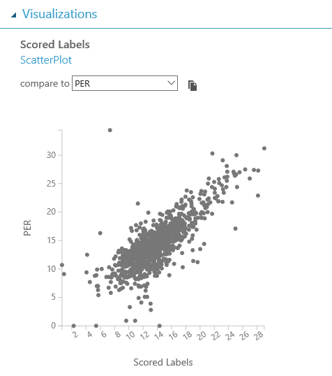
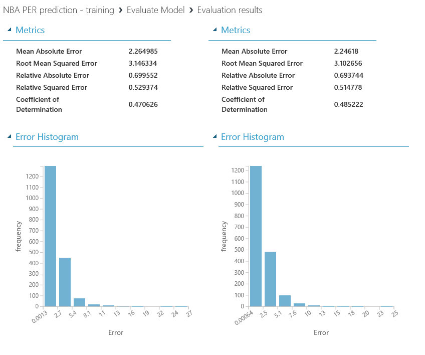
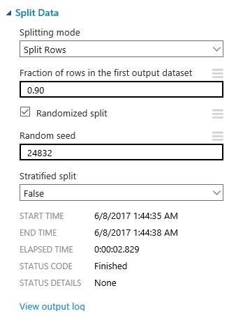
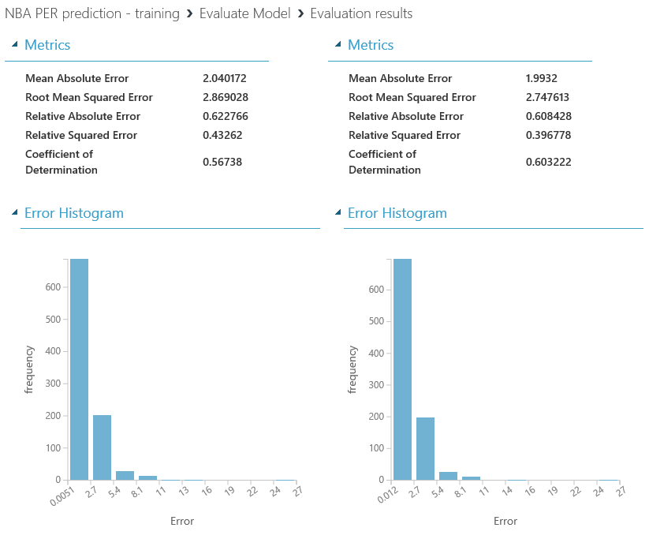

# Chapter 5 - Refine the model and re-evaluate

As you can see, the results aren&#39;t very promising…yet! We&#39;ll tackle some issues on our dataset cleaning by making some adjustments that will boost the performance of our model.

The first thing that will make our data more accurate is to filter by a minimum amount of games played, as it is &quot;easier&quot; to perform better on few games or have a momentum in one game rather than consistently perform at a high level. After some testing, 55 games was one of the best values, so you should update your SQL query to reflect that filter:

```sql
update t1 set Player=PreprocessedPlayer;
select * from t1 where Rank<>"Rk" AND GamesPlayed>=55;
```


If you run the experiment again, you&#39;ll notice that the number of rows on the dataset decreases significantly, the plotting looks better, and the performance is improved reaching 47% and 48% of accuracy respectively:





Things like this are clear examples of how important it is to know the domain of the data that you are handling, not just the technical skills. On every machine learning experiment both data scientists and business savvy people should be included, so this kind of details won&#39;t be missed.

Other thing that would help us to improve the quality of our model is to use a testing set of a similar length as the real case would be. At this point, our testing set (the second dataset resulting of the split), contains almost 2k rows, when the reality is that our input dataset for the next season prediction will just contain 600-700 rows. Let&#39;s also update the amount of data used for training purposes, increasing to 0.90 the amount of data for the first output dataset on the &quot;Split Data&quot; module, as well as using a random seed for the split (let&#39;s use 24832, but again, it&#39;s just question of trying different values and find the one that works better!):



Again, the accuracy of the model gets another good amount of improvement, reaching levels of 0.56 and 0.51 respectively for each algorithm used.

Last but not least, most of the algorithm modules let the user tune some of their settings, and it use to be very useful and helpful to improve the performance of the model. In this case, let&#39;s take the Neural Network Regression module (as it is the one performing slightly worst at this stage) and make some fine tunning.

In this algorithm, there are different parameters that can be edited by you, so let&#39;s reduce the Number of hidden nodes to 32 and also the Learning rate to 0.001. These settings depend on the dataset used and, again, you&#39;ll only get to the right values by trying different adjustments and analyzing the impact on your results. In this case, these adjustments to the Neural Network Regression algorithm has improved the performance, reaching a value of 0.60 on the Coefficient of Determination, and making this algorithm the best one for our model.

