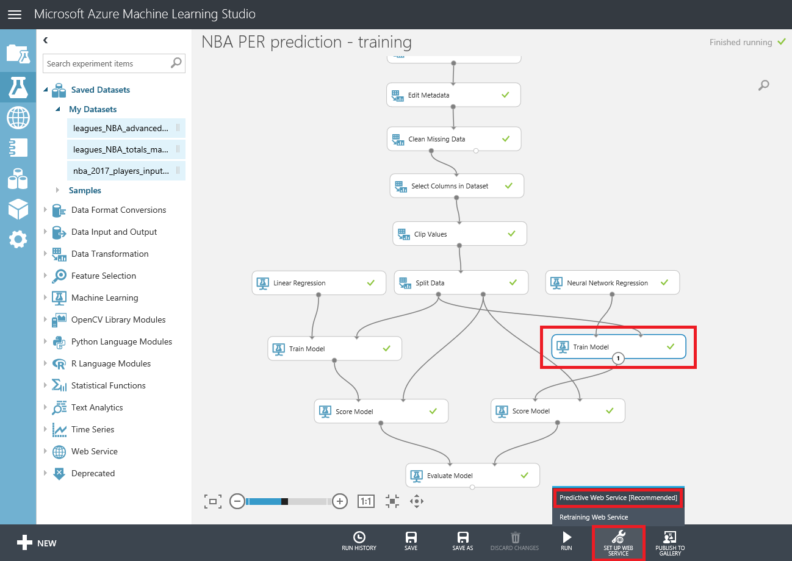
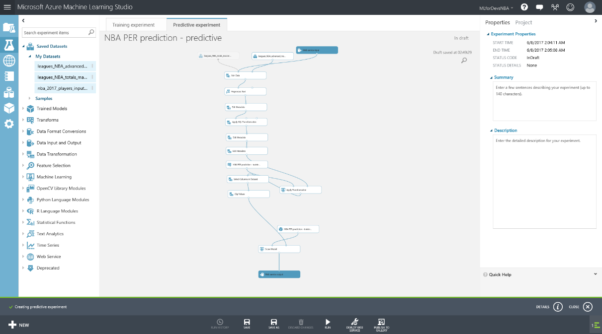
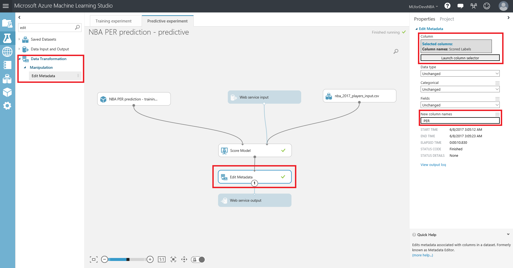
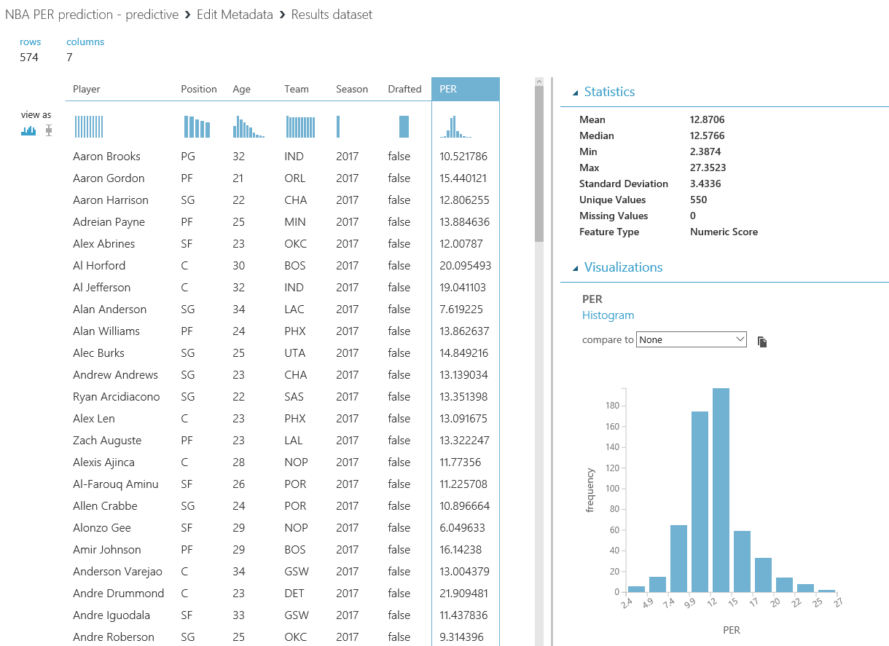

[<- Chapter 5 - Refine the model and re-evaluate](05-Refine%20the%20model%20and%20re-evaluate.md)

# Chapter 6 - Predicting the future

Now that you have improved your model, it&#39;s time to put it to good use by predicting the Player Efficiency Rating for the NBA players on the next season. At this point, all that you have created is the training experiment, the one to prepare your data and train a model just with historic data.

Let&#39;s take it to the next level by creating the predictive experiment based on the algorithm that performed better after the adjustments, the Neural Network Regression. We&#39;ll need to set up the Predictive Web Service, so we can use it both as a module on the Azure ML tool and as an endpoint to request predictions with some input data via HTTP request.

To set up the web service, select the &quot;Train Model&quot; module connected to the Neural Network Regression algorithm, look for the &quot;SET UP WEB SERVICE&quot; button on the bottom bar, and click on &quot;Predictive Web Service [Recommended]&quot; from the pop-up:

Once completed, you&#39;ll see something similar to the screen below:

Note that it is a new experiment (named as [Predictive Experiment] and displayed on a different tab), and that it contains some of the preparation steps of the training experiment, as well as &quot;Web service input&quot; and &quot;Web service output&quot; modules. Note also that there is a new module with the same name you gave to your training experiment, connected to a &quot;Score Model&quot; module.

To set the bases for a useful predictive experiment, let&#39;s connect the &quot;Web service input&quot; module as a dataset input for the &quot;Score Model&quot; module, and just keep the &quot;NBA PER prediction - training&quot; module (our trained model, already packed as one module), the &quot;Score Model&quot; module and both Web service input and output modules by deleting everything else. We won&#39;t need all the other steps involved, as our input dataset for a future prediction already have only the known columns prior the season starts (Player, Position, Age, Team, Season) and we don&#39;t need to perform any cleaning or processing of this data. Let&#39;s also include the dataset with the players for the next season using the third dataset that we uploaded and haven&#39;t used yet: nba\_2017\_players\_input. You can find it on the left menu, under &quot;Saved Datasets &gt; My Datasets&quot; category, and after dragging it to your canvas you should connect it as well with the &quot;Score Model&quot; module as a dataset input. Your predictive experiment should now look like this:

If you run your predictive experiment now, you&#39;ll have a dataset containing the predictions for every NBA player PER for the 2016/2017 season, named as &quot;Scored Labels&quot;. But again, it&#39;s better to give things their proper name, so let&#39;s add an &quot;Edit Metadata&quot; module after the &quot;Score Model&quot; module to rename the column &quot;Scored Label&quot; to the actual name &quot;PER&quot;:

Congratulations! If you take a look at the resulting dataset, you&#39;ll be reading the future, and taking a look at the predicted Player Efficiency Rating value for every active NBA player on the 2016/2017 season. Note that there is also a new column named &quot;Drafted&quot;, which will be useful for the optional visualization and consuming data chapters of this Instructor Led Lab.

[-> BONUS TRACK - Visualize data with Power BI and also interact with it from a conversational bot](./07-BONUS%20TRACK.md)