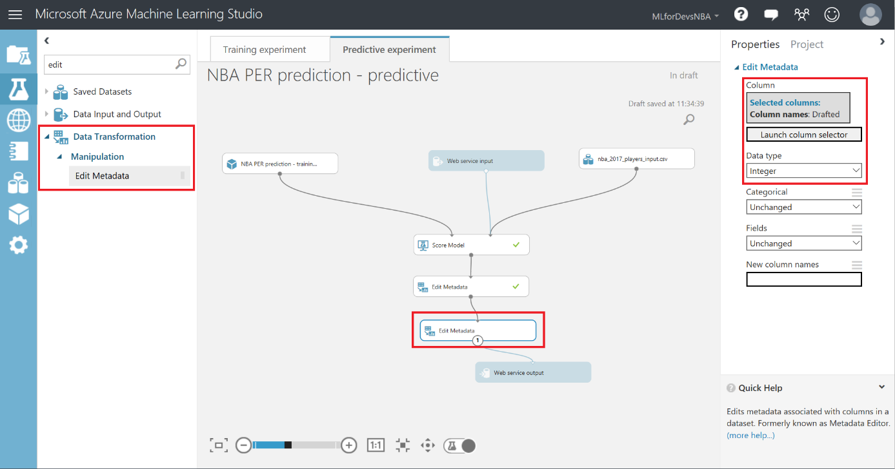
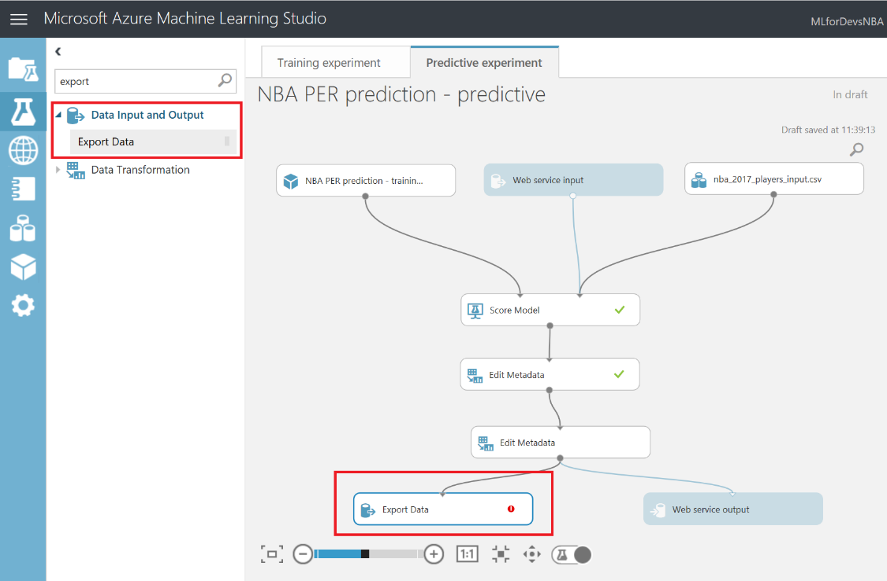
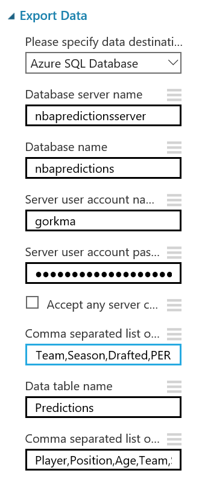
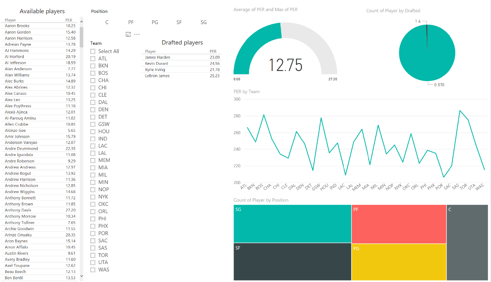
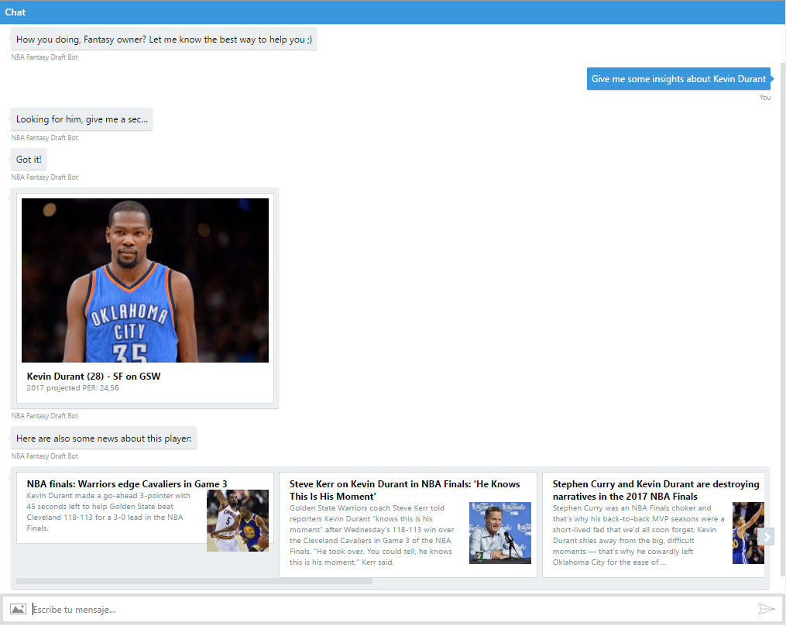
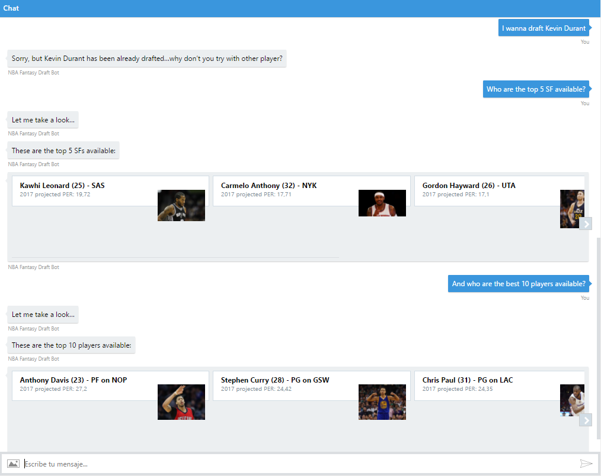

# [BONUS TRACK] Visualize data with Power BI and also interact with it from a conversational bot

If you are planning to complete the optional chapters of this ILL, please take a look at this one and take a couple of last actions required to complete any of them. In this chapter, you&#39;ll export your data to a SQL database so you can consume from both a PowerBI report and a conversational bot.

The first thing you should do is change the data type of the &quot;Drafted&quot; feature to an integer, so let&#39;s add another &quot;Edit Metadata&quot; module and perform this transformation:

After that, you&#39;ll need to export the result of your predictions to a SQL database, so both the PowerBI report and the conversational bot can connect to the data and interact with it. To accomplish that, look for the &quot;Export Data&quot; module on the left menu, under &quot;Data Input and Output&quot; category, drag it to your canvas and connect its input with the output of the last &quot;Edit Metadata&quot; module:

With the &quot;Export Data&quot; module selected, you&#39;ll be able to set up the storage service in which you want to store your data. In this case, the choice is an Azure SQL database, which you&#39;ll need to deploy in advance. Please, follow the link below to find a step by step tutorial to deploy your Azure SQL database, and make sure to include your IP on the SQL server firewall whitelist, or any query will be rejected.

Once you have your Azure SQL database up and running, you&#39;ll need to get the server name, the database name, and the user credentials to access the database from the Azure portal. After that, you just need to type the comma-separated list of columns to be selected from your dataset (in this case: Player,Position,Age,Team,Season,Drafted,PER), give the table in which you want this data to be stored a name of your choice, and give the columns the desired name on the database (in this case, it&#39;s recommended to keep the same names and use the same comma-separated list above, see the image on the right). Once you run again the predictive experiment, all your predictions will be stored on the Azure SQL database, and available for you to query them and consume it from Power BI and any other application which can read from a SQL database. After storing your data in the Azure SQL database, you can follow this steps to connect to your data from Power BI and start creating interactive visualizations which help you to interact with your data easily ( [https://powerbi.microsoft.com/en-us/documentation/powerbi-azure-sql-database-with-direct-connect/](https://powerbi.microsoft.com/en-us/documentation/powerbi-azure-sql-database-with-direct-connect/)):

On this repo ([http://aka.ms/predict-nba-stats](http://aka.ms/predict-nba-stats)) you can also find the code for a conversational bot which will allow you to interact with your predictions via a real conversation. It will require you to set up a LUIS service with different intents, so the bot can understand what you are asking for (in this case: greetings, info about an specific player by name, pick a player, list top players available and list top players available by position). You can also find the bot published on [http://aka.ms/nba-draft-bot](http://aka.ms/nba-draft-bot), including cards with pictures and news about the players retrieved via Cognitive Services:

This is just an example of how you can easily interact with the results of your Machine Learning experiments and enrich the data with some external sources, as we just had cold facts (numbers and info about the player), but lacked of context (the news about an specific player could help you understand his PER rating increase/decrease, or whether if you should pick him or not because of some injuries or team changes)…it&#39;s just a matter of having a clear goal in mind and find the right data for your solution.